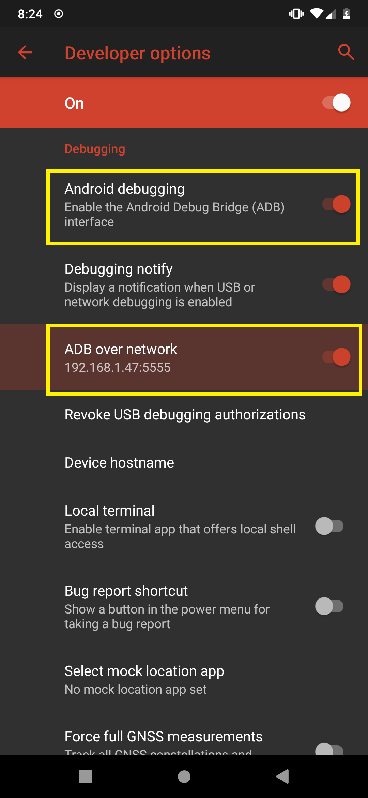

# Installing ADB & scrcpy
Use elevated prompt:
	
	- choco install adb
	- choco install scrcpy

Get the latest release:

https://github.com/StandB/vrphone/releases

# Using 
open main.exe, enter the IP of your Phone and click launch.

You need to have "ADB Debugging" and "ADB over network" enabled

Take note of the IP in the settings, this is the one you'll also need when using VRPhone.

When launching, you might have to trust your PC on the android device.

## Building:
pyinstaller main.spec

## TODO:
- Installer for scrcpy including a shortcut
- Seperate app to render window in VR (on hand, leg or toes)
- Support for network streaming of screen

### Test video:
Using XSOverlay to display the window
https://www.youtube.com/watch?v=SzpQGq81uCc
