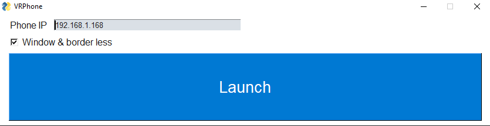

# About
A simple GUI to connect to your phone using [scrcpy](https://github.com/Genymobile/scrcpy).

This EXE only opens a window of scrcpy using your phone's IP. 

The program can't currently display the window in VR, this is done by using an overlay such as [OVRToolkit](https://store.steampowered.com/app/1068820/OVR_Toolkit/) or [XSOverlay](https://store.steampowered.com/app/1173510/XSOverlay/).

This will hopefully be added in the future.

[Releases](https://github.com/StandB/vrphone/releases)

# Using 

You need to have "ADB Debugging" and "ADB over network" enabled

Take note of the IP in the settings, this is the one you'll also need when using VRPhone.

open vrphone.exe, enter the IP of your Phone and click launch.

*Note the extra big Launch button for easier access in VR*

When launching, you might have to trust your PC on the android device.

## Building:
pyinstaller vrphone.spec
